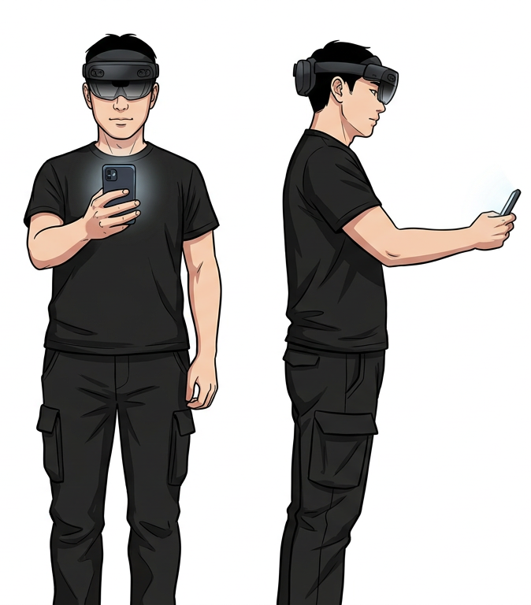
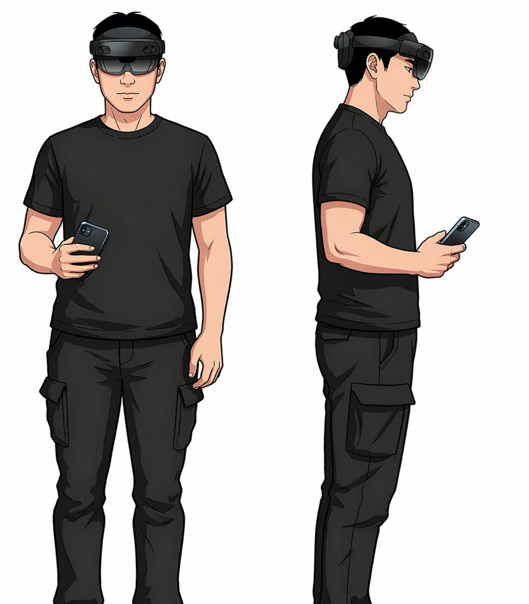
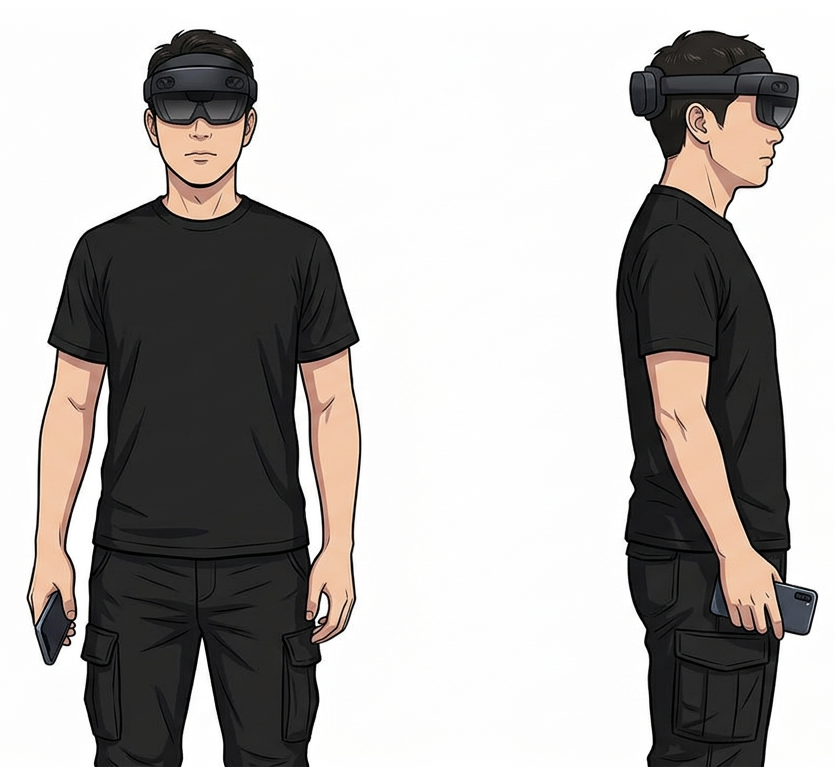

# 스터디 빠른 안내 (KR)

## 1. 개요

- 이 스터디는 4개 컨디션에서 3개 태스크를 수행합니다.
- 컨디션: `Macro - Near Head`, `Macro - Side Of Body`, `Micro - Near Head`, `Micro - Side Of Body`
- 태스크: `Placement`, `Rotation`, `Scaling`
- 컨디션 순서는 `Participant ID`에 따라 달라질 수 있습니다.
- `Macro`와 `Micro` 모두 모든 태스크에서 제출은 `triple tap`입니다.

## 2. 진행 절차

1. 시작 화면에서 배정받은 `Participant ID`를 입력합니다.
2. 필요하면 `Edit` 버튼으로 수정하고, `Continue`를 눌러 시작합니다.
3. 런타임 화면에서 `Scan the QR code to begin.` 안내가 나오면 QR 코드를 스캔합니다.
4. 컨디션이 시작될 때 자세 안내와 예시 이미지가 나오면, 안내된 자세를 잡고 잠시 유지합니다.
5. 카운트다운이 끝나면 과제가 자동으로 시작됩니다. 별도의 `Start` 버튼은 없습니다.
6. 각 태스크 시작 전 짧은 `practice`가 나올 수 있습니다. `practice`는 기록되지 않습니다.
7. 목표를 맞춘 뒤 준비가 되면 `triple tap`으로 제출합니다.
8. 한 컨디션이 끝나면 다음 컨디션으로 자동 진행됩니다.

## 3. 컨디션 개요

### Macro - Near Head

- 팔과 손의 큰 움직임으로 조작합니다.
- 손 위치는 머리 가까이 유지합니다.

### Macro - Side Of Body

- 팔과 손의 큰 움직임으로 조작합니다.
- 손 위치는 몸 옆(side of body)에 둡니다.
- 이 컨디션에서는 입력이 리맵됩니다.
- 손의 위/아래 움직임은 앞/뒤 이동으로 리맵되고, 앞/뒤 움직임은 위/아래 이동으로 리맵됩니다.

### Micro - Near Head

- 손 위치는 머리 가까이 유지합니다.
- 세밀한 조작은 휴대폰 화면을 스와이프해서 수행합니다.

### Micro - Side Of Body

- 손 위치는 몸 옆(side of body)에 둡니다.
- 세밀한 조작은 휴대폰 화면을 스와이프해서 수행합니다.

## 4. 태스크 개요

### Placement

- 도구를 목표 위치에 맞춥니다.
- `Micro`에서는 휴대폰 화면을 좌우/상하로 스와이프해서 위치를 조정합니다.
- 필요하면 `double tap`으로 이동 평면을 바꿔 깊이(앞/뒤) 방향도 조정할 수 있습니다.
- 준비가 되면 `triple tap`으로 제출합니다.

### Rotation

- 도구의 방향을 목표 방향에 맞춥니다.
- `Micro`에서는 좌우 스와이프로 좌우 회전(yaw), 상하 스와이프로 기울기 회전(roll)을 조정합니다.
- 필요하면 `double tap`으로 상하 스와이프 축을 `roll`과 `pitch` 사이에서 전환할 수 있습니다.
- 준비가 되면 `triple tap`으로 제출합니다.

### Scaling

- 도구의 크기를 목표 크기에 맞춥니다.
- `Micro`에서는 상하 스와이프로 크기를 키우거나 줄입니다.
- 준비가 되면 `triple tap`으로 제출합니다.

## 5. 참고

- `Macro`에서는 팔과 손의 움직임으로 조작합니다.
- `Micro`에서는 휴대폰 스와이프로 세밀하게 조작합니다.
- 프록시 핸드가 오브젝트에 충분히 가까우면 잡을 수 있습니다.
- `Macro`에서는 화면을 터치하고 있는 동안 오브젝트를 잡고, 터치를 놓으면 오브젝트를 놓습니다.
- `Micro`에서는 한 번 탭해서 오브젝트를 잡고, 다시 한 번 탭해서 오브젝트를 놓습니다.
- 안내 이미지와 카운트다운이 나오는 동안에는 자세를 크게 바꾸지 않는 것이 좋습니다.
- QR 인식이 잘 안 되거나 화면 또는 입력이 이상하면 진행자에게 바로 알리면 됩니다.

## 6. 최고 중요정보

- 시작 전에 `Participant ID`를 입력하고 `QR`을 스캔합니다.
- 현재 컨디션에 맞게 손 위치를 유지합니다: `Near Head` 또는 `Side Of Body`
- `Macro`는 화면을 누르고 있는 동안 잡고, `Micro`는 탭으로 잡고 놓습니다.
- `Micro`는 휴대폰 스와이프로 조작합니다.
- `Macro - Side Of Body`에서는 위/아래와 앞/뒤 움직임이 리맵됩니다.
- 모든 태스크의 제출은 `triple tap`입니다.
